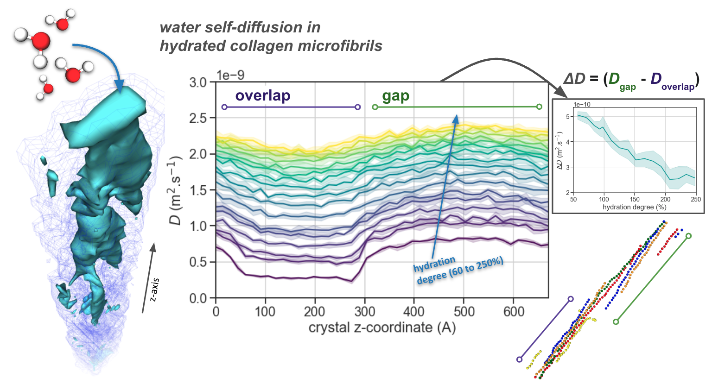

# MD simulations of collagen hydration

Molecular models (PDB structures, and XSC crystal) and scripts for NAMD simulations, MDAnalysis post-treatment and VMD visualisation of hydrated collagen microfibrils molecular models.

The Jupyter Notebook 'collagen_analysis.ipynb' contains the scripts for the analysis of the MD trajectories collagen model simulations using Python and the MDAnalysis library.

The directory 'NAMD_simulation' contains the four NAMD scripts which should be run consecutively (min0 > eq1 > simNPT > relax_constraint) to perform equilibration and relaxation of the hydrated collagen microfibril at room temperature and ambient pressure.

The directory 'PDB_structures' contains for each water content, for each replica (6 in total per water content), the initial PDB structure of the hydrated collagen microfibril (tropocollagen, chlorine ions, and water molecules) as well as the XSC crystal information file associated.

The files are associated with the following publication:

Vassaux, M. (2024). Heterogeneous structure and dynamics of water in a hydrated collagen microfibril. ACS Biomacromolecules (https://doi.org/10.1021/acs.biomac.4c00183)
